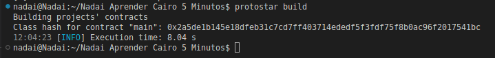

# Cairo
Cairo es el idioma nativo de StarkNet y el primer lenguaje completo de Turing para crear scripts de programas comprobables (donde una parte puede probar a otra que cierto cálculo se ejecutó correctamente) para cálculos generales.

# StarkNet
StarkNet es un ZK-rollup descentralizado que funciona como una cadena de capa 2 de Ethereum. StarkNet permite que las aplicaciones descentralizadas alcancen una escala ilimitada para su cálculo - sin comprometer la descentralización y la seguridad de Ethereum, resolviendo así el trilema de escalabilidad.

En este documento, profundizaremos en la comprensión de la sintaxis de Cairo y cómo podría crear e implementar un contrato inteligente de Cairo en StarkNet.

**NB: Al momento de escribir este artículo, StarkNet todavía está en v0.10.3, y Cairo 1.0 llegará pronto. El ecosistema es joven y evoluciona muy rápido, por lo que es posible que desee consultar los [documentos oficiales](https://www.cairo-lang.org/docs) para confirmar que este documento aún está actualizado. ¡Las solicitudes de extracción son bienvenidas!**

---

# Configuración de un entorno de desarrollo
Antes de comenzar a escribir códigos, necesitaremos configurar un entorno de desarrollo de Cairo para escribir, compilar e implementar nuestros contratos en StarkNet.

A los efectos de este tutorial, utilizaremos [Protostar Framework](https://github.com/software-mansion/protostar). Los pasos de instalación se pueden encontrar en los documentos [aquí](https://docs.swmansion.com/protostar/docs/tutorials/installation).
Tenga en cuenta que Protostar es compatible solo con los sistemas operativos Mac y Linux, es posible que los usuarios de Windows necesiten usar WSL o buscar otras alternativas, como la [CLI oficial de StarkNet](https://www.cairo-lang.org/docs/quickstart.html) o [Nile de Openzeppelin](https://github.com/OpenZeppelin/nile)

Una vez que haya terminado con las instalaciones, ejecute el comando `protostar -v` para confirmar que su instalación fue exitosa. Si tiene éxito, debería ver su versión de Protostar en la pantalla.

## Inicializando un nuevo proyecto
Protostar, similar a Truffle para el desarrollo de solidez, puede instalarse una vez y usarse para múltiples proyectos.
Para inicializar un nuevo proyecto Protostar, ejecute el siguiente comando:

```
protostar init
```

2. Luego solicitaría el nombre del proyecto y el nombre del directorio de la biblioteca, deberá completar esto y un nuevo proyecto se inicializará con éxito.

---

# Compilar, declarar, implementar e interactuar con contratos de StarkNet
A los fines de este tutorial, diríjase y clone localmente.

* [Repositorio Oficial Inglés Darlington02](https://github.com/Darlington02/CairoLearnXinYminutes)
* [Repositorio Oficial Español Nadai2010](https://github.com/Nadai2010/Nadai-Aprender-Cairo-5-Minutos) 

Dentro de la carpeta `src` encontrará un contrato repetitivo que viene con la inicialización de un nuevo proyecto Protostar, `main.cairo`. Vamos a compilar, declarar y desplegar este contrato.


## Compilación de contratos
Para compilar un contrato de Cairo usando Protostar, asegúrese de especificar una ruta al contrato en la sección `[contracts]` del archivo `protostar.toml`. Una vez que hayas hecho eso, abre tu terminal y ejecuta el comando:

```
protostar build
```

Y debería obtener un resultado similar al que ve a continuación, con archivos `main.json` y `main_abi.json` creados en la carpeta `build`.



## Declaración de contratos
Con la reciente actualización de StarkNet a 0.10.3, la transacción DEPLOY quedó obsoleta y ya no funciona. Para implementar una transacción, primero debe declarar un contrato para obtener el hash de clase, luego implementar el contrato declarado utilizando el [Contrato de implementación universal](https://community.starknet.io/t/universal-deployer-contract-proposal/1864).

Antes de declarar o implementar su contrato usando Protostar, debe configurar la clave privada asociada con la dirección de cuenta especificada en un archivo o en la terminal. Para configurar su clave privada en la terminal, ejecute el comando:

```
export PROTOSTAR_ACCOUNT_PRIVATE_KEY=[YOUR PRIVATE KEY HERE]
```

Luego, para declarar nuestro contrato usando Protostar, ejecute el siguiente comando:
```
protostar declare ./build/main.json --network testnet --account 0x03F878C94De81906ba1A016aB0E228D361753536681a776ddA29674FfeBB3CB0 --max-fee auto
```

Donde `network` especifica la red en la que estamos implementando, `account` especifica la cuenta cuya clave privada estamos usando, `max-fee` especifica la tarifa máxima que se pagará por la transacción. Debería obtener el hash de clase como se ve a continuación:


## Implementación de contratos
Después de obtener nuestro hash de clase de la declaración, ahora podemos implementar usando el siguiente comando:

```
protostar deploy 0x02a5de1b145e18dfeb31c7cd7ff403714ededf5f3fdf75f8b0ac96f2017541bc --network testnet --account 0x03F878C94De81906ba1A016aB0E228D361753536681a776ddA29674FfeBB3CB0 --max-fee auto
```

donde `0x02a5de1b145e18dfeb31c7cd7ff403714ededf5f3fdf75f8b0ac96f2017541bc` es el hash de clase de nuestro contrato.


## Interecatuando con Contratos
Para interactuar con su contrato implementado, usaremos Argent X (alternativa - Braavos) y Starkscan (alternativa - Voyager). Para instalar y configurar Argent X, consulte esta [guía](https://www.argent.xyz/learn/how-to-create-an-argent-x-wallet/).

Copie la dirección de su contrato, que se muestra en la pantalla del paso anterior, y diríjase a [Starkscan](https://testnet.starkscan.co/) para buscar el contrato. Una vez encontrado, puede realizar llamadas de escritura al contrato siguiendo los pasos a continuación:

1. Haga clic en el botón "conectar billetera"

2. Seleccione Argent X y apruebe la conexión

3. Ahora puede realizar llamadas de lectura y escritura fácilmente.

# Aprendamos Cairo
```
    // Primero, veamos un contrato predeterminado que viene con Protostar
    // Le permite establecer el saldo en la implementación, aumentar y obtener el saldo.

    // Directiva de idioma - indica al compilador que es un contrato de StarkNet
    %lang starknet

    // Importaciones de la biblioteca desde la biblioteca Cairo-lang.
    from starkware.cairo.common.math import assert_nn
    from starkware.cairo.common.cairo_builtins import HashBuiltin

    // @dev Storage Variable que almacena el saldo de un usuario.
    // @storage_var es un decorador que indica al compilador que la función debajo es una variable de almacenamiento.
    @storage_var
    func balance() -> (res: felt) {
    }

    // @dev Constructor escribe la variable de saldo en 0 en la implementación.
    // Los constructores establecen las variables de almacenamiento en la implementación. Puede aceptar argumentos también.
    @constructor
    func constructor{syscall_ptr: felt*, pedersen_ptr: HashBuiltin*, range_check_ptr}() {
        balance.write(0);
        return ();
    }

    // @dev increase_balance actualiza la variable de saldo.
    // @param amount es la cantidad que desea agregar al saldo.
    // @external es un decorador que especifica la función debajo de ella, es una función externa.
    @external
    func increase_balance{syscall_ptr: felt*, pedersen_ptr: HashBuiltin*, range_check_ptr}(
        amount: felt
    ) {
        with_attr error_message("Amount must be positive. Got: {amount}.") {
            assert_nn(amount);
        }

        let (res) = balance.read();
        balance.write(res + amount);
        return ();
    }

    // @dev returns la variable de saldo.
    // @view es un decorador que especifica la función debajo de ella es una función de vista.
    @view
    func get_balance{syscall_ptr: felt*, pedersen_ptr: HashBuiltin*, range_check_ptr}() -> (res: felt) {
        let (res) = balance.read();
        return (res,);
    }

    // Antes de continuar, intente construir, implementar e interactuar con este contrato.
    // NB: Debería estar en main.cairo si está usando Protostar.

```
**Ahora a las lecciones principales**

### 1. EL TIPO DE DATOS FELT
```
    // A diferencia de solidity, donde tiene acceso a varios tipos de datos, Cairo viene con un solo tipo de datos...felts
    // Felts significa elementos de campo y son un número entero de 252 bits en el rango 0<=x<=P donde P es un número primo.
    // Puede crear un Uint256 en El Cairo utilizando una estructura de dos felts de 128 bits.

    struct Uint256 {
        low: felt, // Los 128 bits bajos del valor.
        high: felt, // Los 128 bits altos del valor.
    }

    // Para evitar tener problemas con las divisiones, es más seguro trabajar con el método unsigned_div_rem de la biblioteca 
    de Cairo-lang.
```

### 2. DIRECTIVA LANG E IMPORTACIONES
```
    // Para comenzar a escribir un contrato StarkNet, debe especificar la directiva:

    %lang starknet

    // Esta directiva le informa al compilador que está escribiendo un contrato y no un programa.
    // La diferencia entre ambos es que los contratos tienen acceso al almacenamiento de StarkNet, los programas no y, como tales, 
    no tienen estado.

    // Hay funciones importantes que puede necesitar importar desde la biblioteca oficial de Cairo-lang o de Openzeppelin. p.ej.
    from starkware.cairo.common.cairo_builtins import HashBuiltin
    from cairo_contracts.src.openzeppelin.token.erc20.library import ERC20
    from starkware.cairo.common.uint256 import Uint256
    from starkware.cairo.common.bool import TRUE
```

### 3.ESTRUCTURAS DE DATOS
```
     // A. STORAGE VARIABLES O VARIABLES DE ALMACENAMIENTO
     // El almacenamiento de Cairo es un mapa con 2^251 ranuras, donde cada ranura es un felt que se inicializa en 0.
     // Creas uno usando el decorador @storage_var

        @storage_var
        func names() -> (name: felt){
        }

    // B. STORAGE MAPPINGS O MAPAS DE ALMACENAMIENTO
    // A diferencia de solidity, donde las asignaciones tienen una palabra clave separada, en Cairo crea asignaciones utilizando 
    // variables de almacenamiento.

        @storage_var
        func names(address: felt) -> (name: felt){
        }

    // C. STRUCTS O ESTRUCTURAS
    // Las estructuras son un medio para crear tipos de datos personalizados en Cairo.
    // Una Struct tiene un tamaño, que es la suma de los tamaños de sus miembros. El tamaño se puede recuperar usando 
    // MyStruct.SIZE.
    // Creas una estructura en Cairo usando la palabra clave `struct`.

        struct Person {
            name: felt,
            age: felt,
            address: felt,
        }

    // D. CONSTANTS O CONSTANTES
    // Las constantes son fijas y, como tales, no se pueden modificar después de configurarlas.
    // Se evalúan como un número entero (field element) en tiempo de compilación.
    // Para crear una constante en Cairo, usa la palabra clave `const`.
    // Es una práctica adecuada poner en mayúscula los nombres constantes.

        const USER = 0x01C6cfC1DB2ae90dACEA243F0a8C2F4e32560F7cDD398e4dA2Cc56B733774E9b

    // E. ARRAYS
    // Los arrays se pueden definir como un puntero (felt*) al primer elemento del arreglo.
    // A medida que se llena una matriz, sus elementos ocupan celdas de memoria contiguas.
    // La palabra clave `alloc` se puede usar para asignar dinámicamente un nuevo segmento de memoria, que se puede usar para 
    almacenar una matriz.

        let (myArray: felt*) = alloc ();
        assert myArray[0] = 1;
        assert myArray[1] = 2;
        assert myArray[3] = 3;

    // También puede usar el operador `new` para crear arreglos de tamaño fijo usando tuplas.
    // El operador new es útil ya que le permite asignar memoria e inicializar el objeto en una sola instrucción.

        func foo() {
            tempvar arr: felt* = new (1, 1, 2, 3, 5);
            assert arr[4] = 5;
            return ();
        }

    // F. TUPLES O TUPLAS
    // Una tupla es una lista finita, ordenada e inalterable de elementos.
    // Se representa como una lista de elementos separados por comas entre paréntesis.
    // Sus elementos pueden ser de cualquier combinación de tipos válidos.

        local tuple0: (felt, felt, felt) = (7, 9, 13);

    // G. EVENTS O EVENTOS
    // Eventos permite que un contrato emita información durante el curso de su ejecución, que puede ser utilizada fuera de 
    // StarkNet.
    // Para crear un evento:

        @event
        func name_stored(address, name) {
        }

    // Para emitir un evento:

        name_stored.emit(address, name);
```

### 4. CONSTRUCTORES, FUNCIONES EXTERNAS Y DE VISTA
```
    // A. CONSTRUCTORS O CONSTRUCTORES 
    // Los constructores son una forma de inicializar las variables de estado en la implementación del contrato 
    // Se crea un constructor usando el decorador @constructor

        @constructor
        func constructor{syscall_ptr: felt*, pedersen_ptr: HashBuiltin*, range_check_ptr}(_name: felt) {
            let (caller) = get_caller_address();
            names.write(caller, _name);
            return ();
        }
    
    // B. EXTERNAL FUNCTIONS O FUNCIONES EXTERNAS
    // Las funciones externas son funciones que modifican el estado de la red.
    // Creas una función externa usando el decorador @external

        @external
        func store_name{syscall_ptr: felt*, pedersen_ptr: HashBuiltin*, range_check_ptr}(_name: felt){
            let (caller) = get_caller_address();
            names.write(caller, _name);
            stored_name.emit(caller, _name);
            return ();
        }

    // C. VIEW FUNCTIONS O VER FUNCIONES
    // Las funciones de visualización no modifican el estado de la cadena de bloques
    // Puedes crear una función de vista usando el decorador @view

        @view
        func get_name{syscall_ptr: felt*, pedersen_ptr: HashBuiltin*, range_check_ptr}(_address: felt) -> (name: felt){
            let (name) = names.read(_address);
            return (name,);
        }

    // NB: A diferencia de Solidity, Cairo admite solo los tipos de función Externa y Vista.
    // Alternativamente, también puede crear una función interna al no agregar ningún decorador a la función.
```

### 5. DECORATORS O DECORADORES
```
    // Todas las funciones en Cairo se especifican con la palabra clave `func`, lo que puede resultar confuso.
    // El compilador utiliza los decoradores para distinguir entre estas funciones.

    // Aquí están los decoradores más comunes que encontrarás en El Cairo:

    // 1. @storage_var — Se utiliza para especificar variables de estado.
    // 2. @constructor — Se utiliza para especificar constructores.
    // 3. @external — Se utiliza para especificar funciones que escriben en una variable de estado.
    // 4. @event — Utilizado para especificar eventos.
    // 5. @view — Se utiliza para especificar funciones que se leen de una variable de estado.
    // 6. @l1_handler — Se utiliza para especificar funciones que procesan mensajes enviados desde un contrato L1 a un puente de 
    mensajería.
```

### 6. CONSTRUCCIONES, CONSEJOS Y ARGUMENTOS IMPLÍCITOS
```
    // A. BUILTINS O CONSTRUCCIONES
    // Los componentes integrados son unidades de ejecución de bajo nivel optimizadas predefinidas, que se agregan a la placa de la CPU de Cairo.
    // Ayudan a realizar cálculos predefinidos como hash de Pedersen, operaciones bit a bit, etc., que son costosos de realizar en Vanilla Cairo.
    // A cada componente integrado en Cairo se le asigna una ubicación de memoria separada, accesible a través de llamadas de memoria regulares de Cairo utilizando parámetros implícitos.
    // Los especificas usando la directiva %builtins

    // Aquí hay una lista de componentes disponibles en El Cairo:
    // 1. output — la salida incorporada se usa para escribir salidas del programa
    // 2. pedersen — el incorporado pedersen se usa para los cálculos hash de pedersen
    // 3. range_check — Esta función incorporada se usa principalmente para comparaciones de enteros y facilita la verificación para confirmar que un elemento de campo está dentro de un rango [0, 2^128)
    // 4. ecdsa — el ecdsa incorporado se usa para verificar las firmas ECDSA
    // 5. bitwise — la función bit a bit se usa para realizar operaciones bit a bit en felts.

    // B. HINTS O PISTAS-CONSEJOS
    // Hints son piezas de códigos de Python, que contienen instrucciones que solo el probador ve y ejecuta
    // Desde el punto de vista del verificador estas pistas no existen
    // Para especificar una pista en Cairo, debe encapsularla dentro de %{ and%}
    // Es una buena práctica evitar el uso de sugerencias tanto como pueda en sus contratos, ya que las sugerencias no se agregan al código de bytes y, por lo tanto, no cuentan en el número total de pasos de ejecución.
    
        %{ 
            # Python hint goes here 
        %}

    // C. IMPLICIT ARGUMENTS O ARGUMENTOS IMPLÍCITOS
    // Los argumentos implícitos no están restringidos al cuerpo de la función, pero pueden ser heredados por otras funciones que los requieran.
    // Los argumentos implícitos se pasan entre brazaletes rizados, como se puede ver a continuación:

        func store_name{syscall_ptr: felt*, pedersen_ptr: HashBuiltin*, range_check_ptr}(_name: felt){
            let (caller) = get_caller_address();
            names.write(caller, _name);
            stored_name.emit(caller, _name);
            return ();
        }
```

### 7. MENSAJES DE ERROR Y CONTROLES DE ACCESO
```
     / Puede crear errores personalizados en Cairo que se envían al usuario en caso de ejecución fallida.
    // Esto puede ser muy útil para implementar controles y mecanismos de control de acceso adecuados.
    // Un ejemplo es evitar que un usuario llame a una función excepto que el usuario sea administrador.

    // importaciones
    from starkware.starknet.common.syscalls import get_caller_address

    // crear una constante de administrador
    const ADMIN = 0x01C6cfC1DB2ae90dACEA243F0a8C2F4e32560F7cDD398e4dA2Cc56B733774E9b

    // implementar control de acceso
    with_attr error_message("You do not have access to make this action!"){
        let (caller) = get_caller_address();
        assert ADMIN = caller;
    }

    //el uso de una declaración de afirmación arroja si la condición no es verdadera, devolviendo así el error especificado.
```

### 8. INTERFACES DE CONTRATO
```

```

### 9. RECURSIÓN
```

```

Algunas cosas de bajo nivel

### 10. REGISTROS
```

```

### 11. REFERENCIAS REVOCADAS
```

```

Miscellaneous

### 12. Entendiendo las puntuaciones de El Cairo
```
    // ; (semicoma). Se utiliza al final de cada instrucción.

    // ( ) (paréntesis). Se usa en una declaración de función, declaraciones if y en una declaración de tupla.

    // { } (corchetes). Se utiliza en una declaración de argumentos implícitos y para definir bloques de código.

    // [ ] (corchetes). Los corchetes independientes representan el valor en una ubicación de dirección particular (como el puntero de asignación, [ap]). Los corchetes que siguen a un puntero o una tupla actúan como un operador de subíndice, donde x[2] representa el elemento con índice 2 en x.

    // * Asterisco único. Hace referencia al puntero de una expresión.

    // % Signo de porcentaje. Aparece al comienzo de una directiva, como %builtins or %lang.

    // %{ %} Representa sugerencias de Python.

    // _ (underscore). Un marcador de posición para manejar valores que no se utilizan, como un valor de retorno de función no utilizado.
```

# EJEMPLO DE CONTRATO COMPLETO
A continuación se muestra un ejemplo de contrato completo que implementa la mayor parte de lo que acabamos de aprender. ¡Reescribe, implementa, diviértete!
```

```