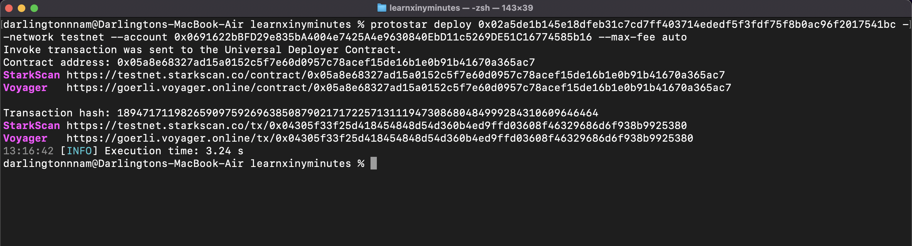

# Cairo
Cairo es el idioma nativo de StarkNet y el primer lenguaje completo de Turing para crear scripts de programas comprobables (donde una parte puede probar a otra que cierto cálculo se ejecutó correctamente) para cálculos generales.

# StarkNet
StarkNet es un ZK-rollup descentralizado que funciona como una cadena de capa 2 de Ethereum. StarkNet permite que las aplicaciones descentralizadas alcancen una escala ilimitada para su cálculo - sin comprometer la descentralización y la seguridad de Ethereum, resolviendo así el trilema de escalabilidad.

En este documento, profundizaremos en la comprensión de la sintaxis de Cairo y cómo podría crear e implementar un contrato inteligente de Cairo en StarkNet.

**NB: Al momento de escribir este artículo, StarkNet todavía está en v0.10.3, y Cairo 1.0 llegará pronto. El ecosistema es joven y evoluciona muy rápido, por lo que es posible que desee consultar los [documentos oficiales](https://www.cairo-lang.org/docs) para confirmar que este documento aún está actualizado. ¡Las solicitudes de extracción son bienvenidas!**

---

# Configuración de un entorno de desarrollo
Antes de comenzar a escribir códigos, necesitaremos configurar un entorno de desarrollo de Cairo para escribir, compilar e implementar nuestros contratos en StarkNet.

A los efectos de este tutorial, utilizaremos [Protostar Framework](https://github.com/software-mansion/protostar). Los pasos de instalación se pueden encontrar en los documentos [aquí](https://docs.swmansion.com/protostar/docs/tutorials/installation).
Tenga en cuenta que Protostar es compatible solo con los sistemas operativos Mac y Linux, es posible que los usuarios de Windows necesiten usar WSL o buscar otras alternativas, como la [CLI oficial de StarkNet](https://www.cairo-lang.org/docs/quickstart.html) o [Nile de Openzeppelin](https://github.com/OpenZeppelin/nile)

Una vez que haya terminado con las instalaciones, ejecute el comando `protostar -v` para confirmar que su instalación fue exitosa. Si tiene éxito, debería ver su versión de Protostar en la pantalla.

## Inicializando un nuevo proyecto
Protostar, similar a Truffle para el desarrollo de solidez, puede instalarse una vez y usarse para múltiples proyectos.
Para inicializar un nuevo proyecto Protostar, ejecute el siguiente comando:

```
protostar init
```

2. Luego solicitaría el nombre del proyecto y el nombre del directorio de la biblioteca, deberá completar esto y un nuevo proyecto se inicializará con éxito.

---

# Compilar, declarar, implementar e interactuar con contratos de StarkNet
A los fines de este tutorial, diríjase a este [repositorio de github]() y clone localmente.

Dentro de la carpeta `src` encontrará un contrato repetitivo que viene con la inicialización de un nuevo proyecto Protostar, `main.cairo`. Vamos a compilar, declarar y desplegar este contrato.


## Compilación de contratos
Para compilar un contrato de Cairo usando Protostar, asegúrese de especificar una ruta al contrato en la sección `[contracts]` del archivo `protostar.toml`. Una vez que hayas hecho eso, abre tu terminal y ejecuta el comando:

```
protostar build
```

Y debería obtener un resultado similar al que ve a continuación, con archivos `main.json` y `main_abi.json` creados en la carpeta `build`.


## Declaración de contratos
Con la reciente actualización de StarkNet a 0.10.3, la transacción DEPLOY quedó obsoleta y ya no funciona. Para implementar una transacción, primero debe declarar un contrato para obtener el hash de clase, luego implementar el contrato declarado utilizando el [Contrato de implementación universal](https://community.starknet.io/t/universal-deployer-contract-proposal/1864).

Antes de declarar o implementar su contrato usando Protostar, debe configurar la clave privada asociada con la dirección de cuenta especificada en un archivo o en la terminal. Para configurar su clave privada en la terminal, ejecute el comando:

```
export PROTOSTAR_ACCOUNT_PRIVATE_KEY=[YOUR PRIVATE KEY HERE]
```

Luego, para declarar nuestro contrato usando Protostar, ejecute el siguiente comando:
```
protostar declare ./build/main.json --network testnet --account 0x0691622bBFD29e835bA4004e7425A4e9630840EbD11c5269DE51C16774585b16 --max-fee auto
```

Donde `network` especifica la red en la que estamos implementando, `account` especifica la cuenta cuya clave privada estamos usando, `max-fee` especifica la tarifa máxima que se pagará por la transacción. Debería obtener el hash de clase como se ve a continuación:


## Implementación de contratos
Después de obtener nuestro hash de clase de la declaración, ahora podemos implementar usando el siguiente comando:

```
protostar deploy 0x02a5de1b145e18dfeb31c7cd7ff403714ededf5f3fdf75f8b0ac96f2017541bc --network testnet --account 0x0691622bBFD29e835bA4004e7425A4e9630840EbD11c5269DE51C16774585b16 --max-fee auto
```

donde `0x02a5de1b145e18dfeb31c7cd7ff403714ededf5f3fdf75f8b0ac96f2017541bc` es el hash de clase de nuestro contrato.


## Interecatuando con Contratos
Para interactuar con su contrato implementado, usaremos Argent X (alternativa - Braavos) y Starkscan (alternativa - Voyager). Para instalar y configurar Argent X, consulte esta [guía](https://www.argent.xyz/learn/how-to-create-an-argent-x-wallet/).

Copie la dirección de su contrato, que se muestra en la pantalla del paso anterior, y diríjase a [Starkscan](https://testnet.starkscan.co/) para buscar el contrato. Una vez encontrado, puede realizar llamadas de escritura al contrato siguiendo los pasos a continuación:

1. Haga clic en el botón "conectar billetera"

2. Seleccione Argent X y apruebe la conexión

3. Ahora puede realizar llamadas de lectura y escritura fácilmente.

# Aprendamos Cairo
```
    // Primero, veamos un contrato predeterminado que viene con Protostar
    // Le permite establecer el saldo en la implementación, aumentar y obtener el saldo.

    // Directiva de idioma - indica al compilador que es un contrato de StarkNet
    %lang starknet

    // Importaciones de la biblioteca desde la biblioteca Cairo-lang.
    from starkware.cairo.common.math import assert_nn
    from starkware.cairo.common.cairo_builtins import HashBuiltin

    // @dev Storage Variable que almacena el saldo de un usuario.
    // @storage_var es un decorador que indica al compilador que la función debajo es una variable de almacenamiento.
    @storage_var
    func balance() -> (res: felt) {
    }

    // @dev Constructor escribe la variable de saldo en 0 en la implementación.
    // Los constructores establecen las variables de almacenamiento en la implementación. Puede aceptar argumentos también.
    @constructor
    func constructor{syscall_ptr: felt*, pedersen_ptr: HashBuiltin*, range_check_ptr}() {
        balance.write(0);
        return ();
    }

    // @dev increase_balance actualiza la variable de saldo.
    // @param amount es la cantidad que desea agregar al saldo.
    // @external es un decorador que especifica la función debajo de ella, es una función externa.
    @external
    func increase_balance{syscall_ptr: felt*, pedersen_ptr: HashBuiltin*, range_check_ptr}(
        amount: felt
    ) {
        with_attr error_message("Amount must be positive. Got: {amount}.") {
            assert_nn(amount);
        }

        let (res) = balance.read();
        balance.write(res + amount);
        return ();
    }

    // @dev returns la variable de saldo.
    // @view es un decorador que especifica la función debajo de ella es una función de vista.
    @view
    func get_balance{syscall_ptr: felt*, pedersen_ptr: HashBuiltin*, range_check_ptr}() -> (res: felt) {
        let (res) = balance.read();
        return (res,);
    }

    // Antes de continuar, intente construir, implementar e interactuar con este contrato.
    // NB: Debería estar en main.cairo si está usando Protostar.

```
**Ahora a las lecciones principales**

### 1. THE FELT DATA TYPE
```
    // Unlike solidity, where you have access to various data types, Cairo comes with just a single data type..felts
    // Felts stands for Field elements, and are a 252 bit integer in the range 0<=x<=P where P is a prime number.
    // You can create a Uint256 in Cairo by utlizing a struct of two 128 bits felts.

    struct Uint256 {
        low: felt, // The low 128 bits of the value.
        high: felt, // The high 128 bits of the value.
    }

    // To avoid running into issues with divisions, it's safer to work with the unsigned_div_rem method from Cairo-lang's library.
```

### 2. LANG DIRECTIVE AND IMPORTS
```
    // To get started with writing a StarkNet contract, you must specify the directive:

    %lang starknet

    // This directive informs the compiler you are writing a contract and not a program. 
    // The difference between both is contracts have access to StarkNet's storage, programs don't and as such are stateless.

    // There are important functions you might need to import from the official Cairo-lang library or Openzeppelin's. e.g.
    
    from starkware.cairo.common.cairo_builtins import HashBuiltin
    from cairo_contracts.src.openzeppelin.token.erc20.library import ERC20
    from starkware.cairo.common.uint256 import Uint256
    from starkware.cairo.common.bool import TRUE
```

### 3. DATA STRUCTURES
```
    // A. STORAGE VARIABLES
    // Cairo's storage is a map with 2^251 slots, where each slot is a felt which is initialized to 0.
    // You create one using the @storage_var decorator

        @storage_var
        func names() -> (name: felt){
        }

    // B. STORAGE MAPPINGS
    // Unlike soldity where mappings have a separate keyword, in Cairo you create mappings using storage variables.

        @storage_var
        func names(address: felt) -> (name: felt){
        }

    // C. STRUCTS
    // Structs are a means to create custom data types in Cairo.
    // A Struct has a size, which is the sum of the sizes of its members. The size can be retrieved using MyStruct.SIZE.
    // You create a struct in Cairo using the `struct` keyword.

        struct Person {
            name: felt,
            age: felt,
            address: felt,
        }

    // D. CONSTANTS
    // Constants are fixed and as such can't be altered after being set.
    // They evaluate to an integer (field element) at compile time.
    // To create a constant in Cairo, you use the `const` keyword.
    // Its proper practice to capitalize constant names.

        const USER = 0x01C6cfC1DB2ae90dACEA243F0a8C2F4e32560F7cDD398e4dA2Cc56B733774E9b

    // E. ARRAYS
    // Arrays can be defined as a pointer(felt*) to the first element of the array.
    // As an array is populated, its elements take up contigous memory cells.
    // The `alloc` keyword can be used to dynamically allocate a new memory segment, which can be used to store an array

        let (myArray: felt*) = alloc ();
        assert myArray[0] = 1;
        assert myArray[1] = 2;
        assert myArray[3] = 3;

    // You can also use the `new` operator to create fixed-size arrays using tuples
    // The new operator is useful as it enables you allocate memory and initialize the object in one instruction

        func foo() {
            tempvar arr: felt* = new (1, 1, 2, 3, 5);
            assert arr[4] = 5;
            return ();
        }

    // F. TUPLES
    // A tuple is a finite, ordered, unchangeable list of elements
    // It is represented as a comma-separated list of elements enclosed by parentheses
    // Their elements may be of any combination of valid types.

        local tuple0: (felt, felt, felt) = (7, 9, 13);

    // G. EVENTS
    // Events allows a contract emit information during the course of its execution, that can be used outside of StarkNet.
    // To create an event:

        @event
        func name_stored(address, name) {
        }

    // To emit an event:

        name_stored.emit(address, name);
```

### 4. CONSTRUCTORS, EXTERNAL AND VIEW FUNCTIONS
```
    // A. CONSTRUCTORS
    // Constructors are a way to intialize state variables on contract deployment
    // You create a constructor using the @constructor decorator

        @constructor
        func constructor{syscall_ptr: felt*, pedersen_ptr: HashBuiltin*, range_check_ptr}(_name: felt) {
            let (caller) = get_caller_address();
            names.write(caller, _name);
            return ();
        }
    
    // B. EXTERNAL FUNCTIONS
    // External functions are functions that modifies the state of the network
    // You create an external function using the @external decorator

        @external
        func store_name{syscall_ptr: felt*, pedersen_ptr: HashBuiltin*, range_check_ptr}(_name: felt){
            let (caller) = get_caller_address();
            names.write(caller, _name);
            stored_name.emit(caller, _name);
            return ();
        }

    // C. VIEW FUNCTIONS
    // View functions do not modify the state of the blockchain
    // You can create a view function using the @view decorator

        @view
        func get_name{syscall_ptr: felt*, pedersen_ptr: HashBuiltin*, range_check_ptr}(_address: felt) -> (name: felt){
            let (name) = names.read(_address);
            return (name,);
        }

    // NB: Unlike Solidity, Cairo supports just External and View function types. 
    // You can alternatively also create an internal function by not adding any decorator to the function.
```

### 5. DECORATORS
```
    // All functions in Cairo are specified by the `func` keyword, which can be confusing.
    // Decorators are used by the compiler to distinguish between these functions.

    // Here are the most common decorators you'll encounter in Cairo:

    // 1. @storage_var — used for specifying state variables.
    // 2. @constructor — used for specifying constructors.
    // 3. @external — used for specifying functions that write to a state variable.
    // 4. @event — used for specifying events
    // 5. @view — used for specifying functions that reads from a state variable.
    // 6. @l1_handler — used for specifying functions that processes message sent from an L1 contract in a messaging bridge.
```

### 6. BUILTINS, HINTS & IMPLICIT ARGUMENTS
```
    // A. BUILTINS
    // Builtins are predefined optimized low-level execution units, which are added to Cairo’s CPU board.
    // They help perform predefined computations like pedersen hashing, bitwise operations etc, which are expensive to perform in Vanilla Cairo.
    // Each builtin in Cairo, is assigned a separate memory location, accessible through regular Cairo memory calls using implicit parameters.
    // You specify them using the %builtins directive

    // Here is a list of available builtins in Cairo:
    // 1. output — the output builtin is used for writing program outputs
    // 2. pedersen — the pedersen builtin is used for pedersen hashing computations
    // 3. range_check — This builtin is mostly used for integer comparisons, and facilitates check to confirm that a field element is within a range [0, 2^128)
    // 4. ecdsa — the ecdsa builtin is used for verifying ECDSA signatures
    // 5. bitwise — the bitwise builtin is used for carrying out bitwise operations on felts

    // B. HINTS
    // Hints are pieces of Python codes, which contains instructions that only the prover sees and executes
    // From the point of view of the verifier these hints do not exist
    // To specify a hint in Cairo, you need to encapsulate it within %{ and%}
    // Its good practice to avoid using hints as much as you can in your contracts, as hints are not added to the bytecode, and thus do not count in the total number of execution steps.

        %{ 
            # Python hint goes here 
        %}

    // C. IMPLICIT ARGUMENTS
    // Implicit arguments are not restrcited to the function body, but can be inherited by other functions calls that require them.
    // Implicit arguments are passed in between curly bracelets, like you can see below:

        func store_name{syscall_ptr: felt*, pedersen_ptr: HashBuiltin*, range_check_ptr}(_name: felt){
            let (caller) = get_caller_address();
            names.write(caller, _name);
            stored_name.emit(caller, _name);
            return ();
        }
```

### 7. ERROR MESSAGES & ACCESS CONTROLS
```
    // You can create custom errors in Cairo which is outputted to the user upon failed execution.
    // This can be very useful for implementing checks and proper access control mechanisms.
    // An example is preventing a user to call a function except user is admin.

    // imports
    from starkware.starknet.common.syscalls import get_caller_address

    // create an admin constant
    const ADMIN = 0x01C6cfC1DB2ae90dACEA243F0a8C2F4e32560F7cDD398e4dA2Cc56B733774E9b

    // implement access control
    with_attr error_message("You do not have access to make this action!"){
        let (caller) = get_caller_address();
        assert ADMIN = caller;
    }

    // using an assert statement throws if condition is not true, thus returning the specified error.
```

### 8. CONTRACT INTERFACES
```

```

### 9. RECURSIONS
```

```

Some low-level stuffs

### 10. REGISTERS
```

```

### 11. REVOKED REFERENCES
```

```

Miscellaneous

### 12. Understanding Cairo's punctuations
```
    // ; (semicolon). Used at the end of each instruction

    // ( ) (parentheses). Used in a function declaration, if statements, and in a tuple declaration

    // { } (curly brackets). Used in a declaration of implicit arguments and to define code blocks.

    // [ ] (square brackets). Standalone brackets represent the value at a particular address location (such as the allocation pointer, [ap]). Brackets following a pointer or a tuple act as a subscript operator, where x[2] represents the element with index 2 in x.

    // * Single asterisk. Refers to the pointer of an expression.

    // % Percent sign. Appears at the start of a directive, such as %builtins or %lang.

    // %{ %} Represents Python hints.

    // _ (underscore). A placeholder to handle values that are not used, such as an unused function return value.
```

# FULL CONTRACT EXAMPLE
Below is a full contract example that implements most of what we just learnt! Re-write, deploy, have fun!
```

```